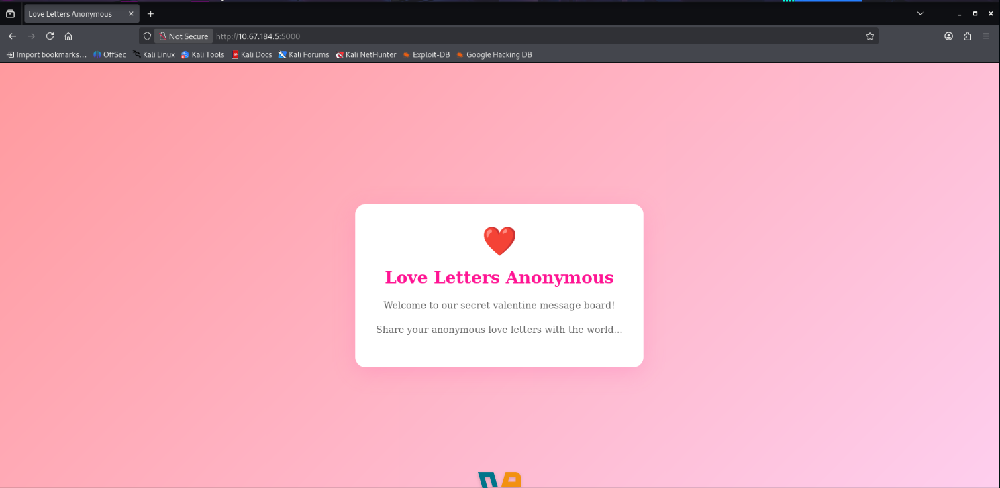

# 🔐 Hidden Deep Into My Heart — Writeup

 

> A detailed write-up of a TryHackMe challenge, focusing on web enumeration, analysis of exposed files, and credential exploitation.
---

## 📌 Overview

- **Platform:** TryHackMe  
- **Challenge:** Hidden Deep Into My Heart  
- **Category:** Web Security  
- **Difficulty:** Easy / Medium  
- **Objective:** Identify vulnerabilities and retrieve the flag  

---

## 🧠 Methodology

A structured approach was used to solve the challenge:

1. Reconnaissance  
2. Directory and file enumeration  
3. Analysis of exposed resources  
4. Credential discovery  
5. Authentication and flag retrieval  

---

## 🌐 Reconnaissance

After connecting to the TryHackMe VPN, the target machine became accessible via a private IP address (`10.x.x.x`) and a specific port.

Initial access was performed through a web browser.

---

## 🔍 Enumeration

Directory and file brute-forcing was performed using `gobuster`:

```bash
gobuster dir -u http://IP:PORT/ \
-w /usr/share/wordlists/dirbuster/directory-list-2.3-medium.txt \
-x txt,bak,zip 
``` 
The use of file extensions (`-x`) enabled the discovery of hidden files in addition to directories.

---

## 📄 robots.txt Analysis

During enumeration, the following file was discovered:
```bash
/robots.txt
```

Although typically used to guide search engine crawlers, this file contained sensitive information.

The content revealed a string that was later used as a valid password.

---

## 📂 Administrative Panel Discovery

Further enumeration revealed an administrative endpoint:
```bash
/administrator
```

Accessing this endpoint presented a login interface.

---

## 🔐 Exploitation

Using previously gathered information:

- **Username:** `admin`  
- **Password:** extracted from `robots.txt`  

Authentication was successful, granting access to the application.

---

## 🏁 Flag Retrieval

Upon successful login, the application redirected directly to a page containing the flag.

> ⚠️ The flag has been omitted to avoid spoilers.

